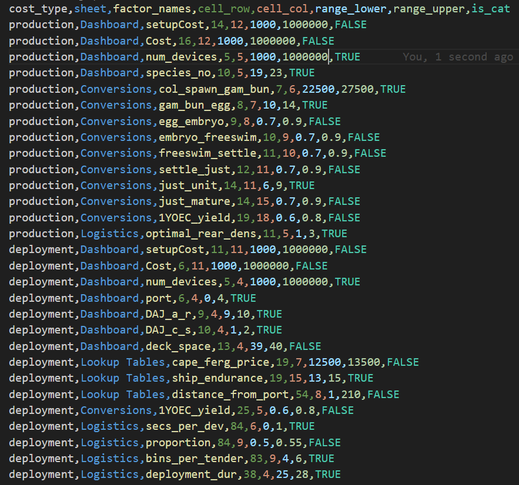

Cost Models
===========

The cost modelling used to calculate intervention costs are Excel-based models developed by the RRAP Translation to
Deployment team. The models to sample need to be downloaded and added to the `cost_models` folder to be accessible by
the functions in this library. They also require two key configuration files to be placed in the `src`` folder.

The file 'config.csv' is a configuration file for sampling the cost model parameters and describes the
names, excel spreadsheet positions and ranges of parameters to sample from the cost models. An example of
this file is below:

A full example of the 'config.csv' file is available in the examples folder. At minimum,
the file must include the following columns:

* `cost_type`` : the model type the parameter belows to (currently either `production` or `deployment`).
* `sheet`` : the sheet name the parameter occurs on.
* `factor_names`` : a label for the factor.
* `cell_row`, `cell_col``: the cell row and column reference for the parameter.
* `range_lower`, `range_upper` : the upper and lower bounds for sampling the parameter.
* `is_cat` : a flag designating whether the parameter is categorical or not.

At minimum, `config.csv` should include info for `setupCost` and `Cost` parameters for both the `production` and
`deployment` models, parameters which are used to extract the setup (CAPEX) and operational (OPEX) cost
respectively for a given intervention.

The other configuration file, `config.json` specifies the path to the cost model excel documents. For example:

.. literalinclude:: config.json
  :language: JSON

Both configuration files should be placed in the same directory as the script calling functions in
`Cost-eco-model-linker`.

Sampling the cost models
------------------------
The Excel-based cost models give CAPEX and OPEX costs of the production and deployment stages of outplanting corals, for a
particular input deployment volume, number of species, distance from port to the deployment reef, and other factors.
These are sampled using functions developed in the `cost_model_queries` python package
`<https://github.com/open-AIMS/cost_model_queries>`_ . More details on the sampling approach can be found in the
documentation for this package : `<https://cost-model-queries.readthedocs.io/en/latest/?badge=latest>`_ .

Calculating costs for interventions over multiple years
-------------------------------------------------------
For outplanting corals over multiple years, the setup costs of production and deployment only scale with the `additional`
corals planned for outplanting compared to the previous year. For example, if 100,000 corals are deployed in the first year,
200,000 in the second year and 200,000 in the third year, the setup costs are $X, $X and $0 respectively. The operational
costs are calculated the same regardless of the year. These year by year cost differences for setup cost are not specified
in the Excel models, but are dealt with in the functions :meth:`cost_calculations.update_setupcost_factors` and
:meth:`cost_calculations.calculate_costs`.

Calculating costs for interventions over multiple reefs
-------------------------------------------------------
The Excel-based cost models take as input a single value for distance to port to calculate deployment costs, so it is
not specified how to deal with intervening on multiple reefs. This is currently dealt with by selecting the largest
distance from port to represent the cost of travel to each of the deployment reefs.
